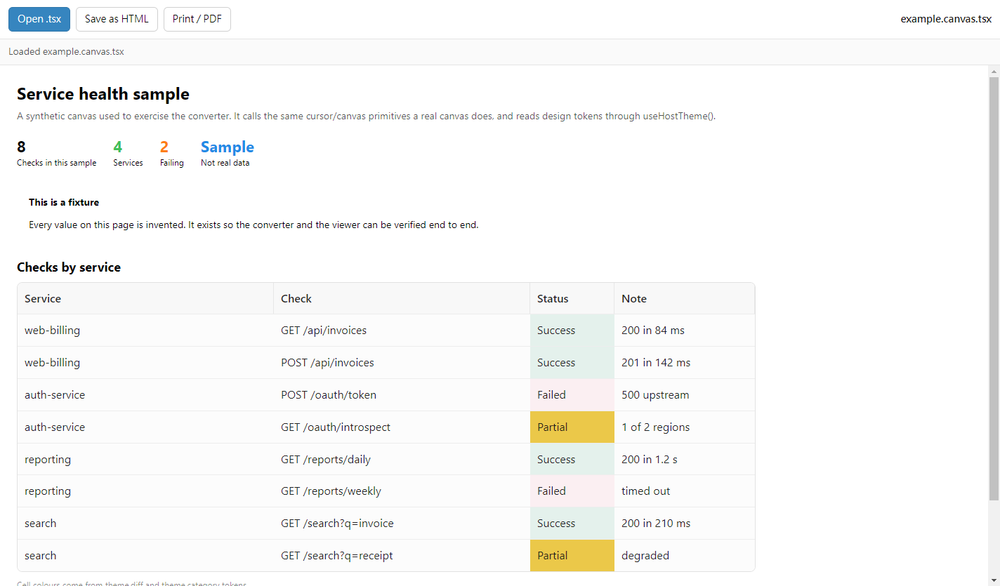
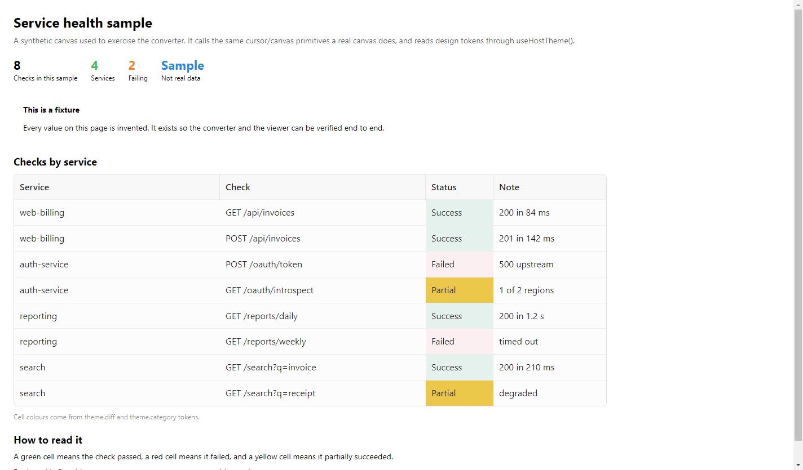
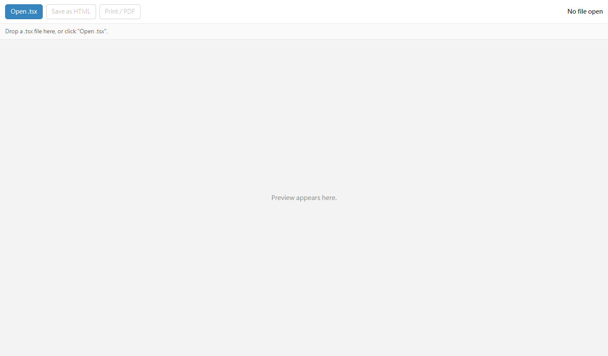
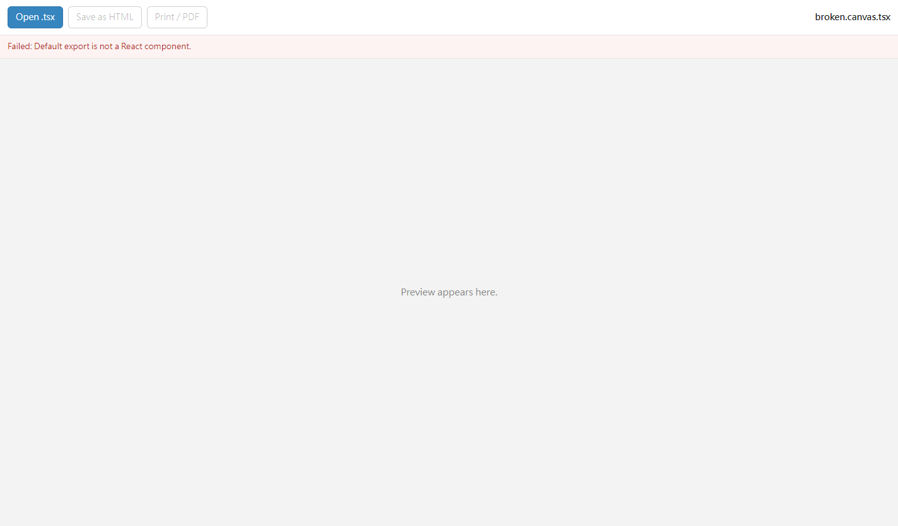

# Canvas Reader with HTML and PDF

[](LICENSE)
[](CHANGELOG.md)
[](https://github.com/nkyang10/tsx-reader-export/releases/latest)

Turn a **Cursor canvas** `.tsx` file into a **single self-contained HTML page** —
and preview it before you ship it. A *canvas* is a `.tsx` file that imports
from `cursor/canvas`, a module that only exists inside the Cursor IDE; this
turns it into ordinary, shareable HTML.



<sub>
All screenshots are rendered from the synthetic fixture in
[`testcases/example.canvas.tsx`](testcases/example.canvas.tsx) — no real data.
Regenerate with `npm run capture`.
</sub>

---

## Why

A Cursor canvas is a React component written against `cursor/canvas` — a
**virtual module** supplied by the IDE at compile time. It does not exist on
npm, so a canvas normally cannot be built or rendered outside Cursor. You cannot
email it, attach it to a ticket, or put it on a share drive.

Canvas Reader renders it for you. The output is **one `.html` file** with all CSS
inlined and **no external requests** — it works offline, opens in any browser,
and can be archived or emailed as a single file.



---

## Download

Grab **`tsx-reader-export-1.0.0-windows-x64.zip`** from the
[releases page](https://github.com/nkyang10/tsx-reader-export/releases/latest) and
extract it anywhere. That's the whole installation.

**Requirements:** Windows 10+ (64-bit). **No installer, no Node.js, no build
tools.**

```
tsx-reader-export-1.0.0-windows-x64\
  tsx-reader-export-viewer\
    tsx-reader-export-viewer.exe     <- Canvas Reader, the app
  tsx-reader-export.exe              <- command line converter
  node_modules\             <- keep next to tsx-reader-export.exe
  run-cli.bat
  LICENSE
  README.txt
```

> **Windows SmartScreen may warn** because the binaries are unsigned. Choose
> *More info → Run anyway*. To avoid it, right-click the `.exe` → *Properties* →
> tick **Unblock**.

---

## The viewer — Canvas Reader

Double-click **`tsx-reader-export-viewer\tsx-reader-export-viewer.exe`**. It starts in about a
fifth of a second.

| What you want | How |
|---|---|
| Open a canvas | **Open .tsx**, or just drag a `.tsx` onto the window |
| See the result | it renders live in the window |
| Keep it | **Save as HTML** — writes a self-contained `.html` |
| Print or make a PDF | **Print / PDF** — opens the Windows print dialog |

For PDF, pick **Microsoft Print to PDF** or **Save as PDF** in that dialog.
The dialog is the OS one, so it also prints to a real printer, or to
OneNote/Word if you have those.

A [`sample-output.pdf`](https://github.com/nkyang10/tsx-reader-export/releases/download/v1.0.0/sample-output.pdf)
is attached to the release, if you want to see the print result before
installing anything.

The reader on its own, and what a bad canvas looks like:

| | |
|---|---|
|  |  |
| Nothing loaded yet | A canvas that failed to render |

---

## The command line

```bat
tsx-reader-export.exe my.canvas.tsx out.html
```

| Option | Meaning |
|---|---|
| `-o, --output <file>` | where to write the HTML (default: same name as the input) |
| `--title <text>` | the page title (default: the input file's name) |
| `--color-scheme <s>` | `light` or `dark` (default: `light`) |
| `--verbose` | print progress to the console |
| `-h, --help` | show help |

Examples:

```bat
tsx-reader-export.exe report.canvas.tsx report.html --title "Q3 Report"
tsx-reader-export.exe report.canvas.tsx report.html --color-scheme dark
```

> Keep `tsx-reader-export.exe` and its `node_modules\` folder together — the executable
> carries its own runtime, but loads React and the canvas components from that
> folder. Prefer an always-visible console? Run `run-cli.bat` instead.

---

## What you get

A single `.html` file that:

- contains **all styling inlined** — zero `<link>` tags, works with no internet;
- needs **no JavaScript at runtime** — it's already rendered;
- opens in any modern browser, prints cleanly, and can be emailed as one file.

---

## If something goes wrong

Both programs write a detailed log if something fails:

| Program | Log file |
|---|---|
| `tsx-reader-export.exe` | `logs\tsx-reader-export.log` next to it (or `%TEMP%\tsx-reader-export.log`) |
| viewer | `%APPDATA%\tsx-reader-export-viewer\viewer.log` |

Each log records the arguments, paths, versions, and the full error. You can also
check the packaged viewer end-to-end without using the UI:

```bat
"tsx-reader-export-viewer\tsx-reader-export-viewer.exe" --smoke path\to\canvas.tsx
```

**Only convert canvases you trust.** A `.tsx` canvas is *executed* (bundled and
rendered) rather than merely parsed, so treat it like any other script you run.

---

## Supported canvas API

The full public `cursor/canvas` surface, via the
[`@thisismydesign/cursor-canvas-web`](https://github.com/thisismydesign/cursor-canvas-web)
shim: `H1` `H2` `H3` `Text` `Code` `Link` · `Stack` `Row` `Spacer` `Grid`
`Divider` · `Card` `Stat` `Pill` `Callout` `Table` · `Button` `IconButton` ·
`Select` `Checkbox` `Toggle` `TextInput` `TextArea` · `LineChart` `BarChart`
`PieChart` · `Swatch` `UsageBar` `CollapsibleSection` `TodoList` `DiffView`
`computeDAGLayout` · hooks `useCanvasState` `useHostTheme` `useCanvasAction`.

Known gaps: `DiffView` falls back to plain text instead of Shiki highlighting,
and `useCanvasAction` is a no-op outside the IDE.

---

<a name="for-developers"></a>

## For developers

<details>
<summary><strong>Build from source</strong> (click to expand)</summary>

```bash
git clone https://github.com/nkyang10/tsx-reader-export.git
cd tsx-reader-export
npm install            # also generates src/styles.generated.mjs
npm run check          # render every fixture
npm run viewer         # run the Electron app from source
```

Node.js 18+ required. Windows is the primary tested platform; the core is
platform-neutral ESM.

</details>

<details>
<summary><strong>npm scripts</strong> (click to expand)</summary>

| Script | Does |
|---|---|
| `npm run check` | regenerate styles, verify manifest versions, render every fixture |
| `npm run build:release` | build both Windows artifacts into `release/` |
| `npm run build:release -- --zip` | …and zip it for distribution |
| `npm run build:exe` | single-file CLI `.exe` into `dist/exe/` |
| `npm run sync` | copy `src/` into `viewer/src/` and `deployment/win/src/` |
| `npm run build:viewer` | copy `src/` into `viewer/src/` only |
| `npm run build:deploy` | sync the Windows deployment folder |
| `npm run capture` | regenerate the README screenshots |
| `npm run viewer` | launch the Electron viewer |
| `npm run tsx-reader-export -- <in> <out>` | run the CLI |
| `npm run viewer:dist` | electron-builder (Windows/macOS/Linux) |

</details>

<details>
<summary><strong>Repository layout</strong> (click to expand)</summary>

`src/` is the single source of truth; everything else is hand-written or
generated.

```
src/            core.mjs, cli.mjs, cli-exe.mjs, cursor-canvas.compat.mjs
                (styles.generated.mjs is generated)
scripts/        build + maintenance scripts
testcases/      canonical fixtures the tool must render
viewer/         Electron app (viewer/src/ is generated)
deployment/win/ self-contained Windows distribution (src/ is generated)
docs/           architecture.md, engineering-log.md, release notes
AGENTS.md       project rules for contributors and agents
```

Generated files are **not** committed — `npm install` regenerates the styles and
`npm run sync` refreshes the copies. See
[`docs/architecture.md`](docs/architecture.md) for the design and the packaging
constraints, and [`AGENTS.md`](AGENTS.md) for the rules.

</details>

---

## Contributing

See [CONTRIBUTING.md](CONTRIBUTING.md). Security reports: [SECURITY.md](SECURITY.md).

## License

**MIT** — the most permissive OSI-approved license, matching our upstream
dependency. Full text in [LICENSE](LICENSE).

Built on
[`@thisismydesign/cursor-canvas-web`](https://github.com/thisismydesign/cursor-canvas-web)
(MIT, © 2026 thisismydesign), the public Mantine-backed shim of Cursor's virtual
`cursor/canvas` module. It is referenced as a dependency, not vendored.
